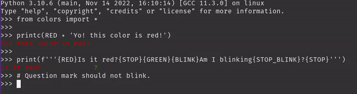

# python-colors
Simple colourfull Python output.

This is a module that assigns terminal [ansi formatting](https://en.wikipedia.org/wiki/ANSI_escape_code) codes to variables. So it is an abstraction above the whole '\033[xx' thing.

Most formatting codes are implemented. 

The module tries to check automatically if colors are supported. If colors are not supported than the color codes turn into empty strings. This means that users on non color supported terminals do not see anything.

There is also a `printc` function where it automatically puts a `f{STOP}\n"` at the end of the normal print.

```python

from colors import *

printc(RED + 'Yo! this color is red!')

print(f'''{RED}Is it red?{STOP}{GREEN}{BLINK}Am I blinking{STOP_BLINK}?{STOP}''')
# Question mark should not blink.
```



You can also use the `show_table` function to see what formatting is supported on your platform. This function is also ran if you run the file directly. When running directly you can specify a number as first argument how many numbers to print.

## Simply download with:

```shell
pip install wget
python -m wget -o colors.py https://raw.githubusercontent.com/tintin10q/python-colors/main/colors.py
```

I hope this is useful for you!
